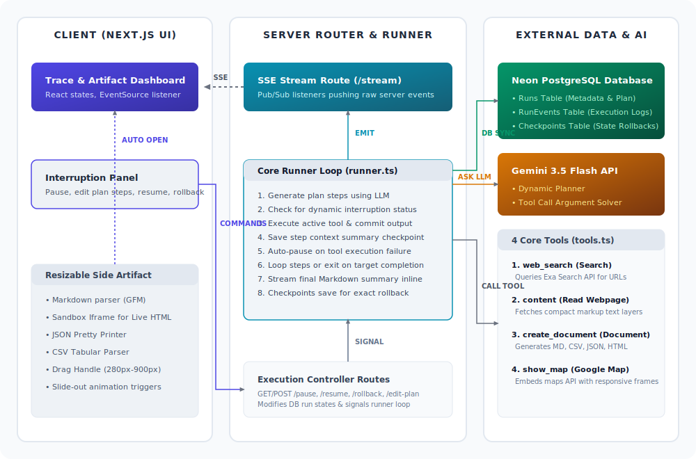

# Heva AI — Live Agent Trace Viewer & Controller

Heva AI is a full-stack dashboard built to make AI agent execution visible, auditable, interruptible, and trustworthy.



---

## 🏗️ Architecture & Flow

Heva AI coordinates front-end React controls, a Node/Next.js execution runner, and stateful databases over a real-time event pipeline:

1. **Planning**: When a user inputs a goal, the server routes the task to the **Gemini 3.5 Flash** planner. The model generates a structured, multi-step execution plan which is saved in the **Neon PostgreSQL DB** and immediately streamed to the UI.
2. **Streaming Execution**: The runner executes step-by-step. Before calling any tool, it streams reasoning thoughts (`reasoning_delta`). When calling a tool, it streams a loading status with parameters, committing the results in real-time using **Server-Sent Events (SSE)**.
3. **Interruption Control Loop**: Before starting any plan step, the server runner verifies if the run state has been flagged as `paused` in the database. When paused, the execution halts, enabling plan modifications, addition of new instruction parameters, or rollback resets.
4. **State Checkpoints & Rollback**: After every step, a full state summary checkpoint is committed to a `checkpoints` table. Clicking **Rollback** in the UI resets the active step index in the DB and resumes execution from that checkpoint.

---

## 🛠️ Integrated Real Tools
All tools are defined in [tools.ts](file:///Users/anuj846k/Developer/hevaai/src/lib/tools.ts) with typed validation schemas:
1. **Search (web_search)**: Connects to Exa search API to retrieve relevant URLs and highlights.
2. **Read Webpage (content)**: Fetches and cleans text layouts of specific URLs (up to 5,000 characters).
3. **Create Document (create_document)**: Generates static markdown, CSV tables, formatted JSON, or sandboxed raw HTML pages for the user.
4. **Google Map (show_map)**: Connects with client Maps API key to render interactive places, directions, or local query listings.

---

## 💡 Key Design Decisions & Engineering Tradeoffs

### 1. Unified Dialog & Sidebar Layout
* **UX Rationale**: Standard log viewers have layout shifts when inputs open or plans are modified. By building a unified, Radix/Base-UI-driven dialog modal, the user can review and edit plan steps in a clean view overlay, leaving the execution feed focused.
* **Engineering Cost**: Merging viewing and editing modes into a single Dialog required state-driven conditional panel swapping and custom callbacks (`handleSavePlan`, `handleCancelEdit`) to manage dialog open/close lifecycle and avoid React 19 re-render conflicts.

### 2. Deferring Env Validation to execution-time
* **UX Rationale**: Placing environment verification checks (like API keys) at module evaluation level causes client-side compilation crashes during Server Component hydration in Next.js. Deferring key validation directly to the `runTool` switch blocks resolved page hydration crashes.

---

## 🚀 Getting Started

### 1. Set environment variables
Create a `.env` file in the root directory:
```env
GOOGLE_API_KEY=your_gemini_api_key
EXA_API_KEY=your_exa_search_api_key
NEXT_PUBLIC_GOOGLE_MAPS_API_KEY=your_maps_key
DATABASE_URL=your_neon_postgresql_url
```

### 2. Install & Run
```bash
pnpm install
pnpm dev
```
Open [http://localhost:3000](http://localhost:3000) to view the live dashboard.
